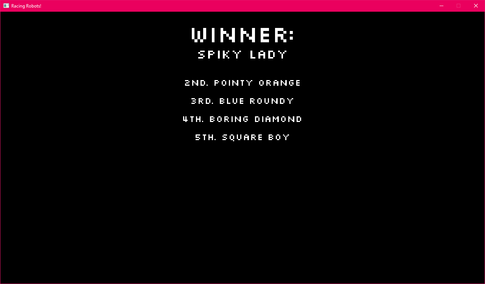
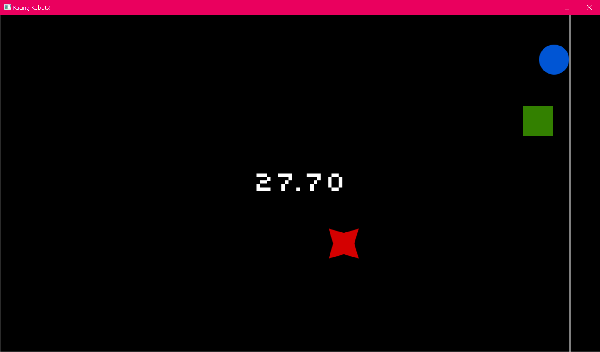
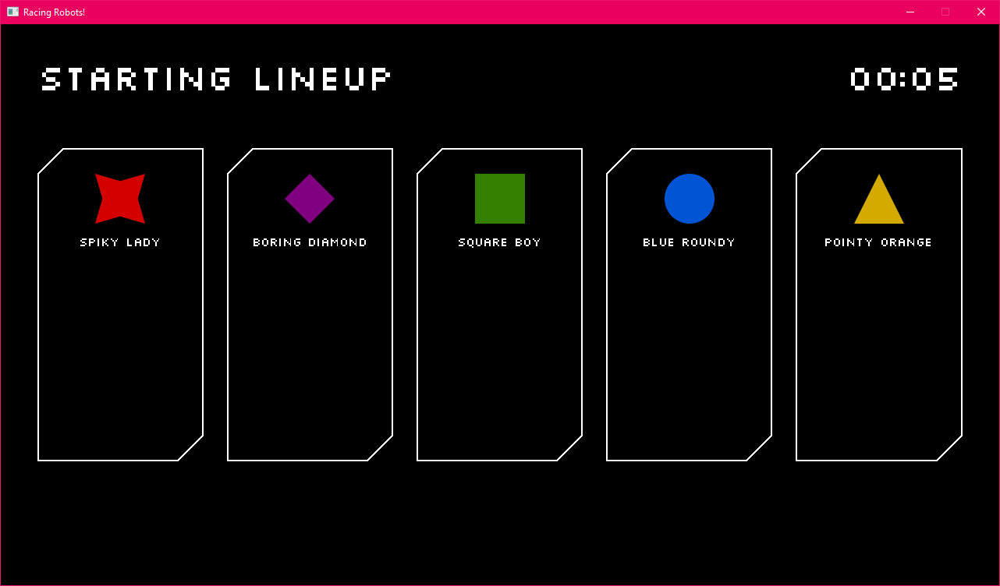
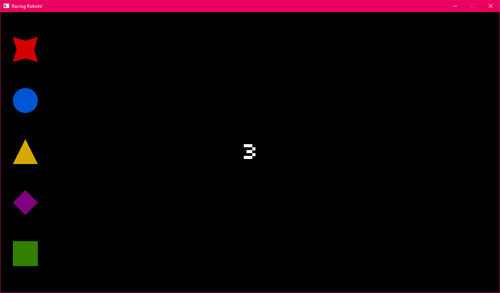

# Racing Robots Dev Diary

In the past I've found it helpful/motivating to keep track of significant 
milestones I reach when I'm working on a project. So here's where I'll do that!

I'm a little late in starting this, so the very beginning entries will be 
missing. Maybe I'll backfill them later.

## 20-02-20 / A very rudimentary summary screen

Real quick I added a very rudimentary results screen that shows after the race.

## 20-02-19 / The finish line!

Today I added a finish line to the race track, and logic to calculate placing 
when robots cross the line. I also added a countdown timer that appears when 
the first robot crosses, so DNFs can be assigned to robots who don't manage 
to finish within 30 seconds after the first-place winner.

I spent an unexpected amount of time changing up my `Countdown` component to 
make it flexible enough to use in several places - next up I need to write a
`Summary` scene so stats and placing information can be displayed after the 
race. After that, the "core loop" will be complete, and you'll be able to watch 
robots race over and over again!

Still trying to think of what to do for better art assets...

## 20-02-17 / Slow but steady progress

Today I made a few cosmetic tweaks, but the main functional improvement is the 
addition of a couple of timers. The first in the lobby while we're waiting for 
players to place bets, and the second on the track counting down to the race 
start.

Also tweaked the title screen a bit.

Next up, I just need some finisher logic, and then we have a full (rudimentary) 
game loop that I can begin trying to set up broadcasting for!

## 20-02-12 / SDL2_gfx and Lobby Improvements

I wanted to render "stats cards" for each robot at various points in the game, 
so I created a `StatCard` entity and started playing with what the card would 
look like. I ended up having to grab 
[SDL2_gfx](https://sourceforge.net/projects/sdl2gfx/) in order to render 
more complex 2D primitives (like thicker lines) which took up a bunch of time 
to build. I ended up writing my own little script to build it on Windows 
[here](https://github.com/haydenmc/sdl2gfx/blob/master/windowsbuild.cmd).

It looks significantly nicer now!

Soon I need to figure out core gameplay mechanics (I have a very very simple 
racing scene up and running now).

## 20-01-26 / Lobby Scene

Today I added a Lobby scene! This is where you'll be able to see a summary 
of the starting lineup for the upcoming race. Eventually, this is where 
spectators will be able to see stats, submit bets, and potentially rig the 
race in various other ways.

For now, though, it's just a rudimentary screen that just paints the robots 
from the current lineup (plus some header text).

I've also added the logic to calculate the current lineup 
(just a simple shuffle), plus some helpful additions to the `Scene` object 
to enable behaviors when the scene is shown by the game, and when it has been 
hidden.

